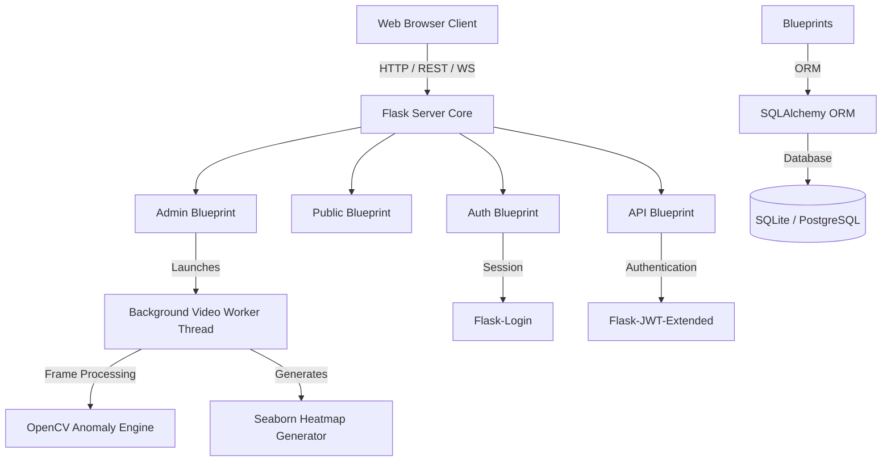
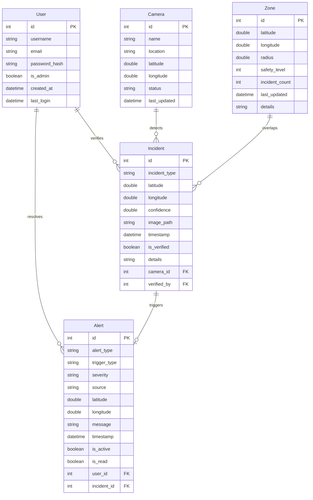

# Raahi Safety Platform - Architecture & Operations Guide

This document describes the technical architecture, database schemas, processing pipelines, design patterns, and deployment configurations of the **Raahi Public Safety Platform**.

---

## 🏗️ System Architecture Plan

Raahi is built as a modular monolithic Flask application adhering to **Clean Architecture** and **SOLID** principles.



### Core Architecture Components

1. **Flask Application Factory (`app.py`)**: Responsible for bootstrapping extensions (SQLAlchemy, LoginManager, Mail, JWTManager) and registering blueprints.
2. **Modular Blueprints (`routes/`)**:
   - `auth.py`: Controls sessions, login cookies, registration validations, and password resets.
   - `public.py`: Manages the citizen-facing home page, static information, and interactive map interface.
   - `admin.py`: Houses the operator dashboard, database incident verifier, camera manager, and CCTV video processing module.
   - `api.py`: Implements token-secured endpoints for mobile integrations, IoT voice triggers, and routing safety computations.
3. **Database Entities (`models.py`)**: Uses SQLAlchemy ORM declarations mapping SQLite schemas to Python model classes.
4. **Asynchronous CCTV Scanning (`routes/admin.py`)**: Operates on standard Python `threading` workers, processing uploaded clips through OpenCV frame analysis and storing results safely.

---

## 🗄️ Database Schemas & Entities

The relational SQLite database structure is shown in the entity mapping below:



---

## 🧵 Offline CCTV Video Processing Pipeline

To maintain high responsiveness without blocking Flask's WSGI request loop, the offline CCTV upload executes as follows:

1. **Upload Handling**: Administrator uploads a clip via `/admin/cctv-analysis/upload`.
2. **Task Registration**: The backend writes the upload details and resets global dictionary state `video_processing_status` to `is_processing: True` with progress at `0%`.
3. **Thread Dispatch**: Launches `process_video_async` in a separate background thread, passing the active application context reference.
4. **Frame Processing**:
   - OpenCV (`cv2.VideoCapture`) extracts video frames.
   - Run fallback anomaly algorithms scanning for high-action events or fire/explosion signs (mocked via structural motion heuristics).
   - Draws bounding boxes around detected anomalies and outputs the processed video to `static/processed/`.
5. **Analytics Synthesis**: Generates Seaborn thermal maps showing activity concentration, updates database `Zone` caution scores automatically, and sets progress to `100%`.
6. **Polling**: Browser UI queries `/admin/cctv-analysis/status` every 2 seconds to draw progress bars, loading indicators, and dynamically inject heatmap matrices.

---

## 🚀 Operations & Deployment Guide

### Prerequisites
- Python 3.10+
- SQLite (default) or PostgreSQL

### Local Development Setup

1. **Clone and Navigate**:
   ```bash
   git clone <repo-url>
   cd Raahi
   ```
2. **Create Virtual Environment**:
   ```bash
   python -m venv venv
   source venv/bin/activate  # On Windows: venv\Scripts\activate
   ```
3. **Install Dependencies**:
   ```bash
   pip install -r requirements.txt
   ```
4. **Environment Variables**:
   Create a `.env` file in the root:
   ```env
   FLASK_APP=main.py
   FLASK_DEBUG=True
   SESSION_SECRET=your-session-secret-key
   JWT_SECRET_KEY=your-jwt-secret-key
   DATABASE_URL=sqlite:///raahi.db
   ```
5. **Run DB Seeds & Launch**:
   ```bash
   python main.py
   ```
   The database will automatically initialize schemas and mock datasets. Accessible at `http://127.0.0.1:5000`.

### Production Deployment (Render)

1. **Gunicorn WSGI**:
   Ensure `gunicorn` is in the dependencies list. Install:
   ```bash
   pip install gunicorn
   ```
2. **Build Settings**:
   Create a new Web Service on Render, linking your repository.
   - **Environment**: Python
   - **Build Command**: `pip install -r requirements.txt`
   - **Start Command**: `gunicorn main:app`
3. **Environment Variables**:
   Define `SESSION_SECRET`, `JWT_SECRET_KEY`, and set `DATABASE_URL` (preferably standard Render PostgreSQL database URL).
